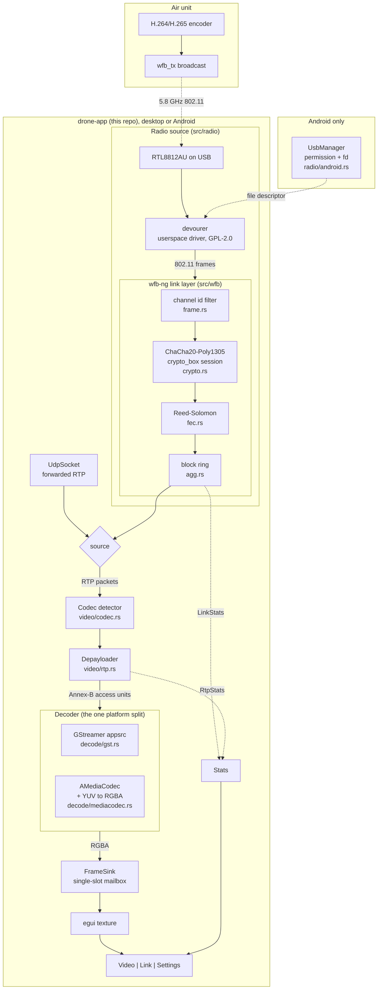

# drone-app

A ground station for a wfb-ng FPV link, written in Rust with
[egui](https://github.com/emilk/egui). One crate builds both a desktop binary
and an Android APK, and either one drives the radio itself.

Plug an RTL8812AU into USB, point it at the channel the air unit is on, and it
receives the link and shows the video. No kernel module, no root, no `wfb_rx`
process, and on Android no Java. The driver is
[devourer](https://github.com/OpenIPC/devourer), a userspace Realtek driver
that talks to the chip over libusb; the wfb-ng link layer on top of it is this
project's, in plain Rust.

- **Radio**: devourer over libusb, on desktop and on an unrooted phone
- **Link layer**: ours, in `src/wfb/` - 802.11 filtering, ChaCha20-Poly1305,
  Reed-Solomon FEC, block reassembly
- **Depayload**: ours, in `src/video/rtp.rs`
- **Decode**: GStreamer on desktop, the NDK's `AMediaCodec` on Android
- **Pages**: Video, Link, Settings, reached from a corner menu

**Licence: GPL-2.0.** devourer is GPL-2.0 with no upgrade clause, so a binary
that links it is too. Every file this project wrote is dual licensed
`MIT OR GPL-2.0-only`, and `--no-default-features` builds an MIT-only viewer
with no devourer in it. The details, including why no wfb-ng code is in this
repository, are in [LICENSING.md](LICENSING.md).

## Two sources, one pipeline

| source | what it needs | what it gives |
| --- | --- | --- |
| `radio` (default) | an RTL8812AU-family adapter on USB, and `gs.key` | the whole ground station on one device |
| `udp` | another machine already running `wfb_rx -c <this device>` | a second screen on a link someone else is receiving |

Both produce RTP packets, so everything downstream is identical and the choice
is one line of config. The forwarded path is kept because it is still the
right answer for a second viewer, and because it is what runs on a phone with
no adapter to hand.

## Why the link layer is ours

wfb-ng is GPL-3.0. devourer is GPL-2.0 **without** the "or any later version"
clause. Those two licences are incompatible, so a binary cannot contain both -
and the radio route needs devourer.

So `src/wfb/` is an independent implementation of the protocol: link-id
filtering off the 802.11 addresses, `crypto_box` to open the session
announcement, ChaCha20-Poly1305 for the data packets, Reed-Solomon over
GF(2^8) for the FEC, and the block ring that puts the packets back in order.
About 1200 lines, all of it portable computation, all of it unit tested.

Being independent, "it decodes its own output" would prove nothing, so it is
tested against the reference implementations instead:
`tools/gen_wfb_fixtures.py` generates vectors from libsodium and from wfb-ng's
own `fec.c`, and `tests/wfb.rs` checks that the parity bytes match, that the
ciphertexts open, and that every one of the 495 ways to lose four of twelve
fragments still reconstructs the block.

## Architecture



The frame mailbox is a single slot rather than a channel on purpose. A channel
keeps every frame, and for video that is exactly wrong: if the UI falls behind,
the frames queue up and the picture drifts further into the past while memory
grows. The slot holds the newest frame and drops the rest, so a slow frame
costs a dropped picture instead of permanent latency. The queue between
devourer's receive thread and the video thread is bounded for the same reason.

## Run (desktop)

Needs a C++20 compiler, CMake, libusb and the GStreamer development packages:

```sh
sudo apt install build-essential cmake pkg-config libusb-1.0-0-dev \
    libgstreamer1.0-dev libgstreamer-plugins-base1.0-dev
git submodule update --init third_party/devourer third_party/libusb
```

Copy `gs.key` from the ground station beside the binary, plug in the adapter,
and run:

```sh
cargo run
```

Reaching a USB device without root needs a udev rule.
`tools/50-drone-app-usb.rules` is one; install it and replug the adapter:

```sh
sudo cp tools/50-drone-app-usb.rules /etc/udev/rules.d/
sudo udevadm control --reload-rules
```

Without it the app reports "cannot open the adapter: LIBUSB_ERROR_ACCESS", and
`sudo -E cargo run` works as a stopgap.

The in-kernel driver must not be holding the dongle. drone-cam's `vrx.sh bind`
handles that, or blacklist `rtw88_8812au` by hand - devourer needs the device
unclaimed, not a patched driver.

### Without an adapter, or without a drone

Set the source to `udp` and feed it a synthetic stream:

```sh
./tools/fake-stream.sh              # H.265, 1280x720, 30 fps, to udp/5600
CODEC=h264 ./tools/fake-stream.sh   # the other codec
PORT=5601 SIZE=640x480 ./tools/fake-stream.sh
```

`fake-stream.sh` stands in for `wfb_rx -u 5600`, so everything downstream of
the link layer is identical and the app cannot tell the difference.

## Run (Android)

One crate builds both: the desktop `[[bin]]` and an Android `cdylib` loaded
from a NativeActivity via `android_main` (`src/lib.rs`). The Android build uses
the `wgpu` renderer, decodes with `AMediaCodec` straight from the NDK, and
reaches `UsbManager` through JNI reflection - so there is still no Java source
and no dex to build.

Prerequisites: Android SDK + NDK, `ANDROID_NDK_HOME` set, and
`rustup target add aarch64-linux-android armv7-linux-androideabi`.

```sh
# no-Java flow with xbuild (recommended), arm64-v8a only
cargo install xbuild
x doctor                              # verify SDK/NDK are found
adb devices -l
x run --release --device adb:<serial>

# or with cargo-apk, which is the only route to an armeabi-v7a APK
cargo install cargo-apk
cargo apk run --lib
```

`--lib` is not optional for cargo-apk: it builds exactly one artifact, and this
crate has both a lib and a bin, which it reports as `Error: Invalid args.`

A plain `cargo build --target aarch64-linux-android` compiles but does not
link, because Rust does not know the NDK's linker. xbuild and cargo-apk set it;
by hand it is:

```sh
NDKBIN=$ANDROID_NDK_HOME/toolchains/llvm/prebuilt/linux-x86_64/bin
export CARGO_TARGET_AARCH64_LINUX_ANDROID_LINKER=$NDKBIN/aarch64-linux-android21-clang
cargo build --lib --target aarch64-linux-android
```

### On the phone

1. Plug the adapter into an OTG adapter or a USB-C hub.
2. Copy `gs.key` to `/sdcard/Android/data/rs.drone.app/files/gs.key` - that
   directory belongs to the app, is reachable over USB and from any file
   manager, and needs no storage permission.
   `adb push gs.key /sdcard/Android/data/rs.drone.app/files/` does it.
3. Start the app and accept the USB permission prompt.
4. Set the channel and link id on the Settings page if they are not the
   defaults.

There is no permission to declare for the adapter: Android grants USB access
per device, at runtime, through the dialog `UsbManager.requestPermission` puts
up. That is exactly why an unrooted phone can run a WiFi driver at all - USB
access is granted to userspace per device rather than mediated by a kernel
driver the app would have to install.

Permissions live in two places that must agree: `manifest.yaml` is what xbuild
reads, and Cargo.toml's `[package.metadata.android]` is what cargo-apk reads.
Neither tool warns when the other's list is short, so edit both.

## Configuration

`drone-app.toml`, beside the binary on desktop and in the app's data dir on
Android. The Settings page edits it live and writes it back in place, so
comments and key order survive a save.

```toml
[source]
kind = "radio"      # "radio" or "udp"
codec = "auto"      # "auto", "h264" or "h265"

[source.radio]
channel = 161       # must match the air unit
bandwidth = 20      # 20 or 40 MHz
link_id = 7669206   # must match the air unit's `wfb_tx -i`
radio_port = 0      # the wfb-ng port carrying video
key = "gs.key"      # relative paths resolve beside the config file

[source.udp]
bind = "0.0.0.0"    # "127.0.0.1" is enough when wfb_rx runs on this machine
port = 5600

[video]
fill = false        # crop to fill the window rather than fitting inside it
overlay = true      # the fps/bitrate readout over the picture
smooth = true       # bilinear scaling; false gives nearest-neighbor

[ui]
ok = "#3cb44b"
error = "#dc503c"
warn = "#e6a020"
background = ""     # empty follows the theme
text = ""
text_scale = 1.0
```

A config written before the radio existed still works: `bind` and `port`
directly under `[source]` are read as `[source.udp]`.

## Pages

| page | what it shows |
| --- | --- |
| Video | the picture, full screen. Tap to switch fit and fill. A corner readout gives codec, resolution, fps, bitrate and loss |
| Link | signal, noise and per-antenna strength; frames heard against frames that were ours; the session and its FEC parameters; packets repaired and packets lost; then everything the RTP layer sees |
| Settings | source, channel, bandwidth, link id, key file, picture options, text size |

When there is no picture the Video page says which stage of the link failed,
because a black screen looks the same for all of them and each has a different
fix: a quiet channel is the wrong channel, a busy channel with none of it ours
is the wrong link id, our frames that will not open is the wrong key, and
packets that will not decode is the codec.

## Supported adapters

The default build covers the RTL8812AU family, the 4T4R RTL8814AU, and the
RTL8812EU - which is what FPV flies, and includes the RTL8812AU-VS that shares
a product id with the 8812EU. `--features radio-all-chips` adds every backend
devourer supports (8822B/C/E, 8821C, 8733B, and the Wi-Fi 6 parts) at roughly
four times the native library size.

## Tests

```sh
cargo test
```

- `src/wfb/fec.rs`, `src/wfb/crypto.rs`, `src/wfb/agg.rs`, `src/wfb/frame.rs` -
  the link layer, unit by unit
- `tests/wfb.rs` - the same code against libsodium and wfb-ng's `fec.c`:
  matching parity bytes, matching ciphertexts, every recoverable loss pattern
  of a real block, and 20000 arbitrary frames through the parsers
- `src/video/rtp.rs` - RTP parsing, FU/STAP/AP reassembly, sequence tracking
  across wraparound, duplicates and restarts
- `src/video/codec.rs` - the H.264/H.265 classifier and its voting
- `src/video/yuv.rs` - the Android color conversion: stride, slice height,
  crop, plane order and both matrices. Android-only code, compiled and tested
  on the desktop, because a phone is not needed to check arithmetic and its
  failures (a shear, a tint) are the kind that look plausible
- `src/radio/mod.rs` - the signal conversion, and that a bad key file is
  refused before an adapter is touched
- `src/config.rs` - the TOML round trip, including that a save keeps comments
  and that a config from before the radio still loads
- `tests/stream.rs` - the video path end to end: ffmpeg encodes a test pattern
  to RTP, the app receives, depayloads and decodes it. Skipped when ffmpeg has
  no encoder

What is not covered is the hardware: no adapter was attached while this was
written, so the radio path is verified by construction and by the link layer's
tests, not on the air. See TODO_complete.md for exactly what that leaves open.
