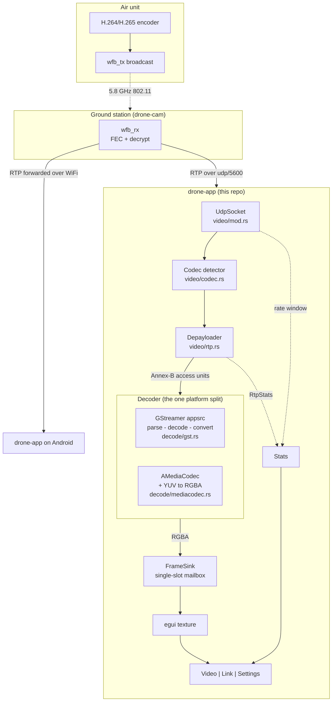

# drone-app

A ground-station video viewer for a wfb-ng FPV link, written in Rust with
[egui](https://github.com/emilk/egui). One crate builds both a desktop binary
and an Android APK.

It shows the H.264/H.265 stream that [drone-cam](../drone-cam)'s `wfb_rx`
unpacks onto a local UDP port, and reports what the link is doing while it does
it.

- **GUI**: egui / eframe, the same stack as [gps-gui-rs](../../gps/gps-gui-rs)
- **Receive and depayload**: ours, in plain Rust (`src/video/rtp.rs`)
- **Decode**: GStreamer on desktop, the NDK's `AMediaCodec` on Android
- **Pages**: Video, Link, Settings, reached from a corner menu

## Why the RTP layer is ours

drone-cam's `vrx.sh view` hands the port straight to GStreamer:

```sh
gst-launch-1.0 udpsrc port=5600 ! rtph265depay ! avdec_h265 ! autovideosink
```

This app receives the UDP itself and depayloads in Rust, then feeds the decoder
Annex-B. That costs a few hundred lines and buys three things:

- **Loss is visible.** A depayloader inside a pipeline consumes the sequence
  numbers and throws them away. On a lossy 5.8 GHz broadcast, what the RTP
  layer saw *is* the diagnostic - FEC repairs some loss and the decoder
  conceals more, so the picture can look fine while the margin is nearly gone.
- **The two platforms report the same number**, because it is the same code on
  both.
- **The platform split is exactly one thing wide.** Everything up to Annex-B is
  shared and unit-tested; only the decoder differs.

## Architecture



The mailbox is a single slot rather than a channel on purpose. A channel keeps
every frame, and for video that is exactly wrong: if the UI falls behind, the
frames queue up and the picture drifts further into the past while memory
grows. The slot holds the newest frame and drops the rest, so a slow frame
costs a dropped picture instead of permanent latency.

## Run (desktop)

Needs the GStreamer development packages, which are headers for a runtime
drone-cam already requires:

```sh
sudo apt install libgstreamer1.0-dev libgstreamer-plugins-base1.0-dev
```

Then, with a stream arriving on udp/5600:

```sh
# in the drone-cam checkout
sudo ./vrx.sh up 161
./vrx.sh rx

# here
cargo run
```

With no drone powered up, generate a stream instead:

```sh
./tools/fake-stream.sh              # H.265, 1280x720, 30 fps, to udp/5600
CODEC=h264 ./tools/fake-stream.sh   # the other codec
PORT=5601 SIZE=640x480 ./tools/fake-stream.sh
```

`fake-stream.sh` stands in for the tail of drone-cam's pipeline: `wfb_rx -u
5600` puts RTP on a local UDP port and so does this, so everything downstream
is identical and the app cannot tell the difference.

## Run (Android)

One crate builds both: the desktop `[[bin]]` and an Android `cdylib` loaded
from a NativeActivity via `android_main` (`src/lib.rs`). The Android build uses
the `wgpu` renderer and decodes with `AMediaCodec` straight from the NDK, so
there is no Java shim and no dex to build.

### The phone is a viewer only

There is no Android equivalent of `vrx.sh up` or `vrx.sh rx`, and there cannot
be a useful one on a stock phone. `up` puts the RTL8812AU into monitor mode on
a channel, which needs root, the patched kernel driver and a regulatory domain;
`rx` captures raw 802.11 frames and does FEC and ChaCha20 decryption on them.
Android gives an unprivileged app none of that - no monitor mode, no raw
sockets, and no way to load a kernel driver for the dongle. The decrypt and FEC
half is ordinary computation and could be ported; the radio half is the wall.

So the laptop keeps doing both, and sends the RTP on to the phone. `wfb_rx`
takes the destination directly, so nothing needs to be forwarded or relayed:

```sh
# on the ground station, in the drone-cam checkout
sudo ./vrx.sh up 161

# then, instead of ./vrx.sh rx, aim wfb_rx at the phone
sudo ~/wfb-ng/wfb_rx -p 0 -u 5600 -K ~/wfb-ng/gs.key -i 7669206 \
    -c <phone ip> <interface>
```

On the phone, leave `bind` at `0.0.0.0` (the default - `127.0.0.1` would only
hear itself) and set the same port on the Settings page.

`wfb_rx` sends to one address, so this replaces the local view rather than
adding to it. To watch on both at once, run a second `wfb_rx` on the same
interface with its own `-c`/`-u`: each instance opens its own capture handle
and both see every frame. Do not try to share one port between two viewers -
`SO_REUSEPORT` load-balances UDP datagrams across the sockets rather than
duplicating them, so each viewer would get roughly half the stream.

Prerequisites: Android SDK + NDK, and `rustup target add aarch64-linux-android`
(add `armv7-linux-androideabi` too for 32-bit devices).

```sh
# no-Java flow with xbuild (recommended), arm64-v8a only
cargo install xbuild
x doctor                              # verify SDK/NDK are found
adb devices -l
x run --release --device adb:<serial>

# or with cargo-apk, which is the only route to an armeabi-v7a APK
cargo install cargo-apk
cargo apk run --lib
```

`--lib` is not optional for cargo-apk: it builds exactly one artifact, and this
crate has both a lib and a bin, which it reports as `Error: Invalid args.` The
cdylib is the Android artifact; the `[[bin]]` is desktop-only.

Permissions live in two places that must agree: `manifest.yaml` is what xbuild
reads, and Cargo.toml's `[package.metadata.android]` is what cargo-apk reads.
Neither tool warns when the other's list is short, so edit both.

## Configuration

`drone-app.toml`, beside the binary on desktop and in the app's data dir on
Android. The Settings page edits it live and writes it back in place, so
comments and key order survive a save.

```toml
[source]
bind = "0.0.0.0"    # "127.0.0.1" is enough when wfb_rx runs on this machine
port = 5600
codec = "auto"      # "auto", "h264" or "h265"

[video]
fill = false        # crop to fill the window rather than fitting inside it
overlay = true      # the fps/bitrate readout over the picture
smooth = true       # bilinear scaling; false gives nearest-neighbor

[ui]
ok = "#3cb44b"
error = "#dc503c"
warn = "#e6a020"
background = ""     # empty follows the theme
text = ""
text_scale = 1.0
```

## Pages

| page | what it shows |
| --- | --- |
| Video | the picture, full screen. Tap to switch fit and fill. A corner readout gives codec, resolution, fps, bitrate and loss |
| Link | packets, loss, reordering, stream restarts, decode errors, and a minute of bitrate and loss history |
| Settings | bind address, port, codec, picture options, text size |

When there is no picture the Video page says which of the four possible faults
it is - nothing arriving, the stream stopped, packets that will not decode, or
a port that would not bind - because a black screen looks the same for all
four and each has a different fix.

## Tests

```sh
cargo test
```

- `src/video/rtp.rs` - RTP parsing, FU/STAP/AP reassembly, sequence tracking
  across wraparound, duplicates and restarts
- `src/video/codec.rs` - the H.264/H.265 classifier and its voting
- `src/video/yuv.rs` - the Android color conversion: stride, slice height,
  crop, plane order and both matrices. Android-only code, compiled and tested
  on the desktop, because a phone is not needed to check arithmetic and its
  failures (a shear, a tint) are the kind that look plausible
- `src/config.rs` - the TOML round trip, including that a save keeps comments
  and keys a newer build might add
- `tests/stream.rs` - the whole path end to end: ffmpeg encodes a test pattern
  to RTP, the app receives, depayloads and decodes it, and the frames are
  checked for size and codec. Skipped when ffmpeg has no encoder

The RF path itself needs the hardware and is not covered here; drone-cam's
tests cover the receiver side.
